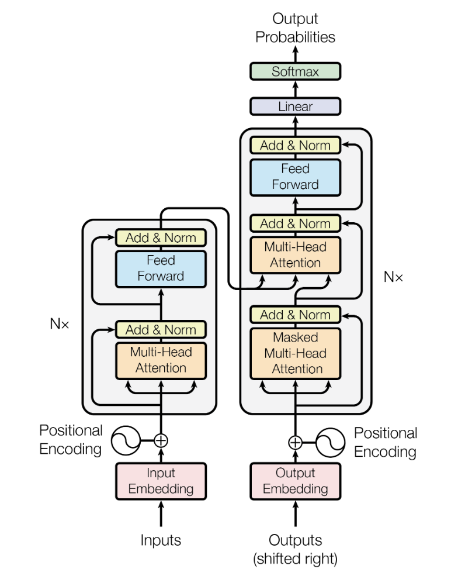
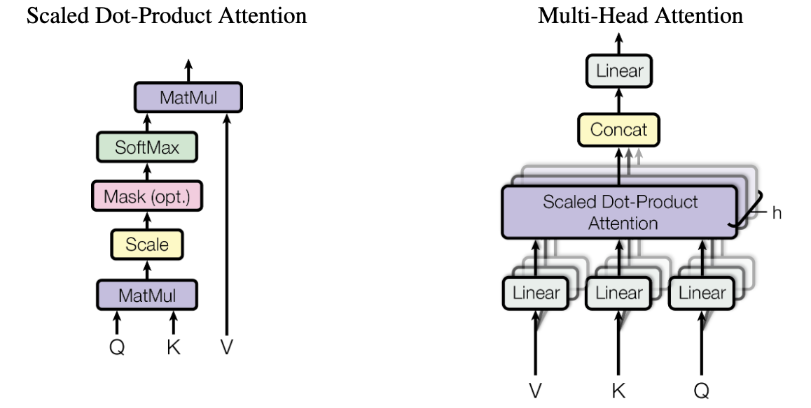
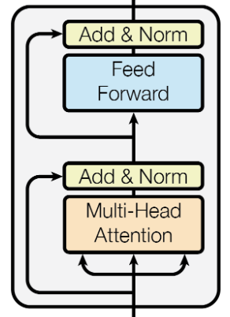
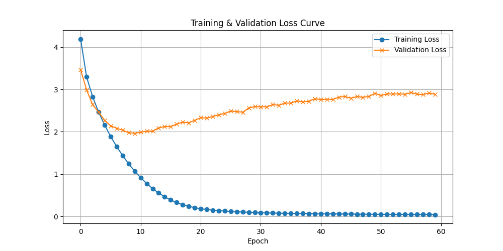

# 基于 Transformer 的机器翻译（英译中）

## 📋 项目背景


### 1. 机器翻译的技术演进
机器翻译（Machine Translation, MT）作为自然语言处理（NLP）领域的核心任务之一, 经历了三个主要发展阶段: 
- **规则驱动时代**（1950s-1990s）: 基于语言学专家制定的语法规则和双语词典进行直译, 受限于语言复杂性难以实现流畅翻译
- **统计学习时代**（2000s-2010s）: IBM提出的基于短语的统计机器翻译（SMT）成为主流, 利用大规模双语语料库学习翻译概率模型
- **神经网络时代**（2017-至今）: 2017 年 Google 提出的 Transformer 架构引发革命, 其自注意力机制突破了传统RNN的序列建模瓶颈

### 2. 英译中任务的特殊挑战
中文与英语的跨语种翻译存在多重难点: 
- **结构差异**: 英语的 SVOC（主谓宾补）结构与中文的意合语法存在映射鸿沟
- **语义鸿沟**: 成语（如"画蛇添足"）、文化专有项（如"红包"）的等效表达问题
- **数据稀缺性**: 高质量英中平行语料规模仅为英法双语数据的 1/5（WMT 2020 统计）

### 3. Transformer 的技术优势
本项目选用 Transformer 架构的核心理由: 
| 特性                | RNN/LSTM          | Transformer       |
|---------------------|-------------------|-------------------|
| 长距离依赖建模       | 随距离衰减         | 全局注意力        |
| 训练并行度           | 序列逐步计算       | 全序列并行        |
| 计算复杂度           | O(n)              | O(n²)            |
| 位置敏感性           | 固有顺序          | 需位置编码        |


## 🛠️ 安装

### 环境配置

```bash
conda create -n translator python=3.10
conda activate translator
pip install -r requirements.txt
```

### 数据集配置

本项目使用 [cmn-eng-simple](https://box.nju.edu.cn/d/b8245873f1e44c9fab65/) 数据集, 包含英中平行语料. 通过链接下载后, 将其放置在 `data` 目录, 结构如下: 

```
data/
└── cmn-eng-simple/
    ├── training.txt       
    ├── validation.txt     
    ├── testing.txt       
    ├── int2word_cn.json   
    ├── word2int_cn.json  
    ├── int2word_en.json  
    └── word2int_en.json  
```

## 🚀 快速运行

``` bash
python main.py --period train
python main.py --period eval
```

## 📊 实验报告

### 模型搭建

Transformer 模型结构如下图所示. 其中, 模型的主要架构包括左侧的编码器（Encoder）, 以及右侧的解码器（Decoder）两个部分. 编码器将输入序列转换为上下文向量, 解码器根据上下文向量生成目标序列. 



我们先从小的组件开始实现, 最后再将它们组合成完整的 Transformer 模型. 

1. input Embedding

    在将自然语言输入模型前, 我们首先会对其进行分词, 再根据词汇表将每个词根转换为对应的 token. 例如 `i am a student .` 会被转化为 `[5, 98, 9, 415, 4]`. 这样自然语言就变成了计算机可以理解的数值形式. 当然, 对于深度学习模型来说, 这还不够. 现在每个 token 还是处于文本空间当中, 我们希望将其投影到模型的语义空间, 以便模型更好地理解和处理其特征. PyTorch 已经提供了一个模块 `torch.nn.Embedding` 用于该操作. 初始化时, 与机器翻译相关的参数包括

    - 词汇表大小: `num_embeddings (int)`
    - 特征维度: `embedding_dim (int)`
    - 填充标记: `padding_idx (int, optional)`

    在构建最终的模型时, 我们直接使用即可. 

2. Positional Encoding

    在自然语言中, 单词的顺序是非常重要的. 为了让模型能够理解单词的顺序, 我们需要为每个单词添加一个位置编码. 位置编码是一个与单词嵌入（word embedding）相同维度的向量, 它包含了单词在句子中的位置信息. 论文中给出的位置编码公式如下: 

    $PE_{(pos, 2i)} = sin(pos / 10000^{2i/d_{model}})$

    $PE_{(pos, 2i+1)} = cos(pos / 10000^{2i/d_{model}})$

    其中, $pos$ 是单词在句子中的位置, $i$ 是位置编码的维度索引, $d_{model}$ 是嵌入向量的维度. 我们可以直接将其理解为一个编码层, Transformer 的输入首先通过该编码层, 获得位置编码. 代码实现如下: 

    ```python
    class PositionEncoding(nn.Module):
        def __init__(self, max_seq_len: int, d_model: int):
            super().__init__()
            assert d_model % 2 == 0, "d_model must be even."
            # 由于位置编码是一个二元函数, 可以考虑使用一个二维的矩阵来表示
            i_pos = torch.linspace(
                0, max_seq_len - 1, max_seq_len
            )  # [0, 1, 2, ..., max_len-1] 表示 pos
            j_dim = torch.linspace(
                0, d_model - 2, d_model // 2
            )  # [0, 2, 4, ..., d_model-2] 表示偶数的 dim

            # 生成一个 [max_len, d_model//2] 的网格网格
            # pos.shape: [max_len, d_model//2], two_i.shape: [max_len, d_model//2]
            pos, two_i = torch.meshgrid(i_pos, j_dim, indexing="ij")
            # pe_two_i.shape: [max_len, d_model//2]
            pe_two_i = torch.sin(pos / (10000 ** (two_i / d_model)))
            # pe_two_i_1.shape: [max_len, d_model//2]
            pe_two_i_1 = torch.cos(pos / (10000 ** (two_i / d_model)))

            # 将 pe_two_i 和 pe_two_i_1 拼接成一个 [max_len, d_model] 的矩阵
            # 考虑先拼成 [max_len, d_model//2, 2] 的矩阵, 然后再展平
            # 利用 torch.stack 将两个 tensor 沿着最后一个维度堆叠 (若使用 torch.cat 的话则直接连接了, 不符合偶奇间隔的要求)
            pe = torch.stack([pe_two_i, pe_two_i_1], dim=-1)  # [max_len, d_model//2, 2]
            pe = pe.reshape(
                1, max_seq_len, d_model
            )  # [1, max_len, d_model] 预留出 batch 维度
            # 注册为 buffer, 即不需要更新的参数 (需要更新的参数为 parameter)
            # 当我们使用 model.to(device) 时, buffer 和 parameter 都会自动转移到对应的设备上
            self.register_buffer("pe", pe, False)

        def forward(self, x: torch.Tensor) -> torch.Tensor:
            """
            Args:
                x: [batch_size, seq_len, d_model]
            Returns:
                x: [batch_size, seq_len, d_model]
            """
            _, seq_len, d_model = x.shape
            assert seq_len <= self.pe.shape[1], "seq_len exceeds max_len."
            assert d_model == self.pe.shape[2], "d_model mismatch."
            # 直接加上位置编码
            return x + self.pe[:, :seq_len, :]
    ```

3. Multi-Head Attention

    在 Transformer 中, 注意力机制是一个非常重要的组成部分. 它允许模型在处理输入序列时, 关注序列中的不同部分. Multi-Head Attention 是一种将多个注意力头（attention head）结合起来的方法. 每个注意力头都有自己的参数集, 可以学习到不同的特征表示. 最终的输出是所有注意力头的输出拼接在一起. 

    

    其公式如下所示: 

    $\text{MultiHead}(Q, K, V) = \text{Concat}(\text{head}_1, \ldots, \text{head}_h)W^O$

    其中, $Q, K, V$ 分别表示查询（Query）、键（Key）和值（Value）, $h$ 表示头数, $W^O$ 是一个线性变换矩阵. 每个头的计算公式为: 

    $\text{head}_i = \text{Attention}(QW_i^Q, KW_i^K, VW_i^V)$

    其中, $W_i^Q$, $W_i^K$, $W_i^V$ 是每个头的线性变换矩阵. 注意力机制的计算公式为: 

    $\text{Attention}(Q, K, V) = \text{softmax}(\frac{QK^T}{\sqrt{d_k}})V$


    其中, $d_k$ 是键的维度. 
    
    Multi-Head Attention 的代码实现如下: 

    ```python
    class MultiHeadAttention(nn.Module):
        def __init__(self, d_model: int, heads: int, dropout: float = 0.1):
            super().__init__()

            assert d_model % heads == 0, "d_model must be divisible by heads."
            self.d_model = d_model
            self.heads = heads
            self.dim_head = d_model // heads
            inner_dim = heads * self.dim_head
            self.WQ = nn.Linear(d_model, inner_dim)
            self.WK = nn.Linear(d_model, inner_dim)
            self.WV = nn.Linear(d_model, inner_dim)
            self.attend = nn.Softmax(dim=-1)
            self.dropout = nn.Dropout(dropout)
            self.fc = nn.Linear(inner_dim, d_model)
            self.INF = float(1e12)

        def forward(
            self,
            q: torch.Tensor,
            k: torch.Tensor,
            v: torch.Tensor,
            mask: Optional[torch.Tensor] = None,
        ) -> torch.Tensor:
            """
            Args:
                q: [batch_size, q_len, d_model]
                k: [batch_size, k_len, d_model]
                v: [batch_size, k_len, d_model]
                mask (optional): [batch_size, 1, q_len, k_len]
            Returns:
                out: [batch_size, seq_len, d_model]
            """

            assert q.shape[0] == k.shape[0] == v.shape[0], "batch size mismatch."
            assert k.shape[1] == v.shape[1], "key and value length mismatch."
            # [batch_size, len, d_model] 
            # -> [batch_size, len, inner_dim] 
            # -> [batch_size, len, heads, dim_head] 
            # -> [batch_size, heads, len, dim_head]
            Q = rearrange(self.WQ(q), "b l (h d) -> b h l d", h=self.heads)
            K = rearrange(self.WK(k), "b l (h d) -> b h l d", h=self.heads)
            V = rearrange(self.WV(v), "b l (h d) -> b h l d", h=self.heads)
            dots = torch.matmul(Q, K.transpose(-2, -1)) / (
                self.dim_head**0.5
            )  # [batch_size, heads, q_len, k_len]
            if mask is not None:
                # mask 为判断条件, 将 mask 为 True 的部分填充为自定义的 -inf
                # 如果直接使用 python 自带的 inf 进行填充的话会得到 nan
                dots.masked_fill_(mask, -self.INF)
            attn = self.attend(dots)
            out = rearrange(
                torch.matmul(attn, V), "b h l d -> b l (h d)"
            )  # [batch_size, q_len, inner_dim]
            out = self.fc(self.dropout(out))
            return out
    ```
    > 需要特别注意的是, 此处在设置 mask 时, 我们没有直接使用 Python 中自带的 inf, 而是设置了一个自定义的大数. 若直接使用 inf, 在计算 Softmax 后, 会出现对应位置值为 nan 的情况. 

4. Feed Forward

    Feed Forward 是 Transformer 中的一个重要组成部分. 它是一个两层的前馈神经网络, 通常使用 ReLU 激活函数. 其公式如下: 

    $\text{FFN}(x) = \text{ReLU}(xW_1 + b_1)W_2 + b_2$
    
    其中, $W_1, b_1$ 是第一层的权重和偏置, $W_2, b_2$ 是第二层的权重和偏置. Feed Forward 的代码实现如下: 

    ```python
    class FeedForward(nn.Module):
        def __init__(self, d_model: int, d_ff: int, dropout: float = 0.1):
            super().__init__()
            self.linear1 = nn.Linear(d_model, d_ff)
            self.dropout = nn.Dropout(dropout)
            self.linear2 = nn.Linear(d_ff, d_model)
            self.relu = nn.ReLU()

        def forward(self, x: torch.Tensor) -> torch.Tensor:
            """
            Args:
                x: [batch_size, seq_len, d_model]
            Returns:
                out: [batch_size, seq_len, d_model]
            """
            out = self.linear1(x)
            out = self.relu(out)
            out = self.dropout(out)
            out = self.linear2(out)
            return out
    ```

5. Encoder Layer

    

    每个 Encoder Layer 主要由两部分组成: Multi-Head Attention（此处的 Multi-Head Attention 为 Self-Attention） 和 Feed Forward. 它们之间还有一个 Add & Norm 的处理, 即残差连接（Residual Connection）和层归一化（Layer Normalization）. 残差连接允许梯度在反向传播时更容易地流过网络, 从而加速训练. 层归一化用于稳定训练过程. Encoder Layer 的代码实现如下: 

    ```python
    class EncoderLayer(nn.Module):
        def __init__(self, d_model: int, heads: int, d_ff: int, dropout: float = 0.1):
            super().__init__()
            self.self_attention = MultiHeadAttention(d_model, heads, dropout)
            self.ffn = FeedForward(d_model, d_ff, dropout)
            self.dropout1 = nn.Dropout(dropout)
            self.ln1 = nn.LayerNorm(d_model)
            self.dropout2 = nn.Dropout(dropout)
            self.ln2 = nn.LayerNorm(d_model)

        def forward(
            self, x: torch.Tensor, mask: Optional[torch.Tensor] = None
        ) -> torch.Tensor:
            x = self.ln1(x + self.dropout1(self.self_attention(x, x, x, mask)))
            x = self.ln2(x + self.dropout2(self.ffn(x)))
            return x
    ```

6. Decoder Layer

    Decoder Layer 与 Encoder Layer 类似. 但需要注意的是, Decoder Layer 中第一个 Multi-Head Attention 为 Self-Attention, 其中, Q、K、V 均来自 Decoder 的输入；第二个 Multi-Head Attention 则为 Cross-Attention, 其中, Q 来自 Decoder 的输入, K、V 则为 Encoder 的输出. 其代码实现如下: 

    ```python
    class DecoderLayer(nn.Module):
        def __init__(self, d_model: int, heads: int, d_ff: int, dropout: float = 0.1):
            super().__init__()
            self.self_attention = MultiHeadAttention(d_model, heads, dropout)
            self.dropout1 = nn.Dropout(dropout)
            self.ln1 = nn.LayerNorm(d_model)
            self.cross_attention = MultiHeadAttention(d_model, heads, dropout)
            self.dropout2 = nn.Dropout(dropout)
            self.ln2 = nn.LayerNorm(d_model)
            self.ffn = FeedForward(d_model, d_ff, dropout)
            self.dropout3 = nn.Dropout(dropout)
            self.ln3 = nn.LayerNorm(d_model)

        def forward(
            self,
            x: torch.Tensor,
            encoder_kv: torch.Tensor,
            dst_mask: Optional[torch.Tensor] = None,
            src_dst_mask: Optional[torch.Tensor] = None,
        ) -> torch.Tensor:
            x = self.ln1(x + self.dropout1(self.self_attention(x, x, x, dst_mask)))
            x = self.ln2(
                x
                + self.dropout2(
                    self.cross_attention(x, encoder_kv, encoder_kv, src_dst_mask)
                )
            )
            x = self.ln3(x + self.dropout3(self.ffn(x)))
            return x
    ```

7. Encoder

    编码器由多个编码器层堆叠而成. 其代码实现如下: 

    ```python
    class Encoder(nn.Module):
        def __init__(
            self,
            vocab_size: int,
            pad_idx: int,
            d_model: int,
            d_ff: int,
            n_layers: int,
            heads: int,
            dropout: float = 0.1,
            max_seq_len: int = 512,
        ):
            super().__init__()
            # pad 不参与梯度计算
            self.embedding = nn.Embedding(vocab_size, d_model, pad_idx)
            self.position_encoding = PositionEncoding(max_seq_len, d_model)
            self.layers = nn.ModuleList(
                [EncoderLayer(d_model, heads, d_ff, dropout) for _ in range(n_layers)]
            )
            self.dropout = nn.Dropout(dropout)

        def forward(self, x, src_mask: Optional[torch.Tensor] = None):
            x = self.embedding(x)
            x = self.position_encoding(x)
            x = self.dropout(x)
            for layer in self.layers:
                x = layer(x, src_mask)
            return x
    ```

8. Decoder

    解码器由多个解码器层堆叠而成. 其代码实现如下: 

    ```python
    class Decoder(nn.Module):
        def __init__(
            self,
            vocab_size: int,
            pad_idx: int,
            d_model: int,
            d_ff: int,
            n_layers: int,
            heads: int,
            dropout: float = 0.1,
            max_seq_len: int = 512,
        ):
            super().__init__()
            self.embedding = nn.Embedding(vocab_size, d_model, pad_idx)
            self.position_encoding = PositionEncoding(max_seq_len, d_model)
            self.layers = nn.ModuleList(
                [DecoderLayer(d_model, heads, d_ff, dropout) for _ in range(n_layers)]
            )
            self.dropout = nn.Dropout(dropout)

        def forward(
            self,
            x: torch.Tensor,
            encoder_kv,
            dst_mask: Optional[torch.Tensor] = None,
            src_dst_mask: Optional[torch.Tensor] = None,
        ):
            x = self.embedding(x)
            x = self.position_encoding(x)
            x = self.dropout(x)
            for layer in self.layers:
                x = layer(x, encoder_kv, dst_mask, src_dst_mask)
            return x
    ```

有了以上的组件, 我们就可以将它们组合成完整的 Transformer 模型了. Transformer 模型的代码实现如下: 

```python
class Transformer(nn.Module):
    def __init__(
        self,
        src_vocab_size: int,
        dst_vocab_size: int,
        pad_idx: int,
        d_model: int,
        d_ff: int,
        n_layers: int,
        heads: int,
        dropout: float = 0.1,
        max_seq_len: int = 512,
    ):
        super().__init__()
        self.encoder = Encoder(
            src_vocab_size,
            pad_idx,
            d_model,
            d_ff,
            n_layers,
            heads,
            dropout,
            max_seq_len,
        )
        self.decoder = Decoder(
            dst_vocab_size,
            pad_idx,
            d_model,
            d_ff,
            n_layers,
            heads,
            dropout,
            max_seq_len,
        )
        self.pad_idx = pad_idx
        self.output_layer = nn.Linear(d_model, dst_vocab_size)

    def generate_mask(
        self, q_pad: torch.Tensor, k_pad: torch.Tensor, apply_causal_mask: bool = False
    ):
        # q_pad shape: [n, q_len]
        # k_pad shape: [n, k_len]
        # q_pad k_pad dtype: bool
        assert q_pad.device == k_pad.device, "padding mask must be same device."
        n, q_len = q_pad.shape
        n, k_len = k_pad.shape

        mask_shape = (n, 1, q_len, k_len)
        if apply_causal_mask:
            # Decoder mask
            mask = 1 - torch.tril(
                torch.ones(mask_shape)
            )  # 对角线以上全为 1, 即屏蔽之前的信息

        else:
            # Encoder mask
            mask = torch.zeros(mask_shape)
        mask = mask.to(q_pad.device)
        for i in range(n):
            mask[i, :, q_pad[i], :] = 1
            mask[i, :, :, k_pad[i]] = 1
        mask = mask.to(torch.bool)
        return mask

    def forward(self, x, y):
        src_pad_mask = x == self.pad_idx
        dst_pad_mask = y == self.pad_idx
        src_mask = self.generate_mask(
            q_pad=src_pad_mask, k_pad=src_pad_mask, apply_causal_mask=False
        )  # 使用 encoder mask
        dst_mask = self.generate_mask(
            q_pad=dst_pad_mask, k_pad=dst_pad_mask, apply_causal_mask=True
        )  # 使用 decoder mask
        src_dst_mask = self.generate_mask(
            q_pad=dst_pad_mask, k_pad=src_pad_mask, apply_causal_mask=False
        )
        encoder_kv = self.encoder(x, src_mask)
        res = self.decoder(y, encoder_kv, dst_mask, src_dst_mask)
        res = self.output_layer(res)
        return res
```

除了已有的小组件之外, 可以看到 Transformer 中还包括了一个很重要的函数 `generate_mask`, 该函数用于生成 padding mask 和 causal mask. padding mask 用于屏蔽掉输入序列中的填充部分, 而 causal mask 则用于屏蔽掉解码器中当前 token 之后的部分. 这样可以确保模型在生成下一个 token 时, 只能看到当前 token 之前的部分. 

至此, 模型就已搭建完毕. 

### 数据处理

如 `input embedding` 中提到的, 我们需要将自然语言转换为计算机可以理解的数值形式. 在 `cmn-eng-simple` 数据集当中, 已经预先定义好了自然语言词语与 token 之间的一对一映射关系, 具体可见 `int2word_cn.json`、`int2word_en.json`、`word2int_cn.json`、`word2int_en.json` 四个文件, 我们可以直接使用这些文件来进行数据处理. 为了方便后续的训练和评测时按照 batch 进行处理, 我们同时将数据集封装成了 `torch.utils.data.Dataset` 的形式. 数据集的代码实现如下: 

```python
import os
import json
import torch
from torch.utils.data import Dataset

SPLIT = {"train": "training", "val": "validation", "test": "testing"}


class TranslationDataset(Dataset):
    def __init__(self, data_dir, split="train"):
        assert split in SPLIT.keys(), "Invalid split name."
        split = SPLIT[split]
        self.data_dir = data_dir
        self.int2cn, self.int2en, self.cn2int, self.en2int = self._read_vocab()
        data_file = os.path.join(data_dir, f"{split}.txt")
        if not os.path.exists(data_file):
            raise FileNotFoundError(f"Data file {data_file} not found.")
        self.pairs = []  # [([...], [...]), (...), ...]
        with open(data_file, "r", encoding="utf-8") as f:
            for line in f:
                en, cn = line.strip().split("\t")  # 制表符作为分隔符
                # 处理英文中的@@符号
                en = en.replace("@@", "").split()  # 默认分隔符是空格
                cn = cn.split()
                self.pairs.append((en, cn))

    def __len__(self):
        return len(self.pairs)

    def __getitem__(self, idx):
        en_tokens = [
            self.en2int.get(tok, self.en2int["<UNK>"]) for tok in self.pairs[idx][0]
        ]
        cn_tokens = [
            self.cn2int.get(tok, self.cn2int["<UNK>"]) for tok in self.pairs[idx][1]
        ]

        # 添加特殊标记
        en = [self.en2int["<BOS>"]] + en_tokens + [self.en2int["<EOS>"]]
        cn = [self.cn2int["<BOS>"]] + cn_tokens + [self.cn2int["<EOS>"]]

        return torch.LongTensor(en), torch.LongTensor(cn)

    def _read_vocab(self):
        data_dir = self.data_dir
        int2cn_file = os.path.join(data_dir, "int2word_cn.json")
        int2en_file = os.path.join(data_dir, "int2word_en.json")
        cn2int_file = os.path.join(data_dir, "word2int_cn.json")
        en2int_file = os.path.join(data_dir, "word2int_en.json")
        # 判断文件是否存在
        if (
            not os.path.exists(int2cn_file)
            or not os.path.exists(int2en_file)
            or not os.path.exists(cn2int_file)
            or not os.path.exists(en2int_file)
        ):
            raise FileNotFoundError(
                "Vocabulary files not found in the specified directory."
            )
        with open(int2cn_file, "r", encoding="utf-8") as f:
            int2cn = json.load(f)
        with open(int2en_file, "r", encoding="utf-8") as f:
            int2en = json.load(f)
        with open(cn2int_file, "r", encoding="utf-8") as f:
            cn2int = json.load(f)
        with open(en2int_file, "r", encoding="utf-8") as f:
            en2int = json.load(f)

        return int2cn, int2en, cn2int, en2int
```

其中, `<BOS>`、`<EOS>` 和 `<UNK>` 分别表示句子的开始、结束和未知 token. 我们可以通过如下方式检验能否正确加载数据集: 

```python
if __name__ == "__main__":
    data_dir = "data/cmn-eng-simple"
    dataset = TranslationDataset(data_dir, split="train")
    print(f"Number of samples: {len(dataset)}\n")
    for i in range(3):
        en, cn = dataset[i]
        print("English: ", end=" ")
        for word in en:
            print(dataset.int2en[str(word.item())], end=" ")
        print("\nChinese: ", end=" ")
        for word in cn:
            print(dataset.int2cn[str(word.item())], end=" ")
        print("\n")
```

输出结果如下所示: 

```txt
Number of samples: 18000

English:  <BOS> it 's none of your concern . <EOS> 
Chinese:  <BOS> 这不关 你 的 事 .  <EOS> 

English:  <BOS> she has a habit of <UNK> ting her na ils . <EOS> 
Chinese:  <BOS> 她 有 咬 <UNK> 的 习惯 .  <EOS> 

English:  <BOS> he is a teacher . <EOS> 
Chinese:  <BOS> 他 是 老师 .  <EOS>  
```

### 模型训练及评估

1. 定义超参数

    ```python
    # Config
    period = args.period  # train or eval
    d_model = 512 # 模型内部维度
    d_ff = 2048 # 前馈网络维度
    n_layers = 6 # 编码器和解码器层数
    heads = 8 # 注意力头数
    dropout = 0.1 # dropout 概率
    max_seq_len = 100 # 最大序列长度
    batch_size = 64 # 批次大小
    lr = 1e-4 # 学习率
    n_epochs = 60 # 训练轮数
    print_interval = 50 # 打印间隔 
    device = "cuda" if torch.cuda.is_available() else "cpu" # 设备
    ```

    其中 `period` 通过命令行参数传入, 表示当前是训练还是验证阶段. 

2. 加载数据集

    ```python
    data_dir = "data/cmn-eng-simple"
    train_set = TranslationDataset(data_dir, split="train")
    val_set = TranslationDataset(data_dir, split="val")
    test_set = TranslationDataset(data_dir, split="test")
    train_loader = build_dataloader(train_set, batch_size=batch_size)
    val_loader = build_dataloader(val_set, batch_size=batch_size)
    test_loader = build_dataloader(test_set, batch_size=batch_size)
    en2int, cn2int, int2en, int2cn = (
        train_set.en2int,
        train_set.cn2int,
        train_set.int2en,
        train_set.int2cn,
    )
    en_vocab_size = len(en2int)
    cn_vocab_size = len(cn2int)
    PAD_ID = en2int["<PAD>"]
    BOS_ID = cn2int["<BOS>"]
    ```

    其中,  `build_dataloader` 函数用于构建数据加载器, 代码实现如下: 

    ```python
    def build_dataloader(dataset, batch_size=32, shuffle=True, num_workers=4):
        en2int, cn2int = dataset.en2int, dataset.cn2int

        def _collate_fn(batch):
            en_batch, cn_batch = zip(*batch)

            # 加上 padding, 补齐到相同长度, 默认是在右侧进行 padding
            en_padded = pad_sequence(
                en_batch, batch_first=True, padding_value=en2int["<PAD>"]
            )

            cn_padded = pad_sequence(
                cn_batch, batch_first=True, padding_value=cn2int["<PAD>"]
            )
            return {
                "source": en_padded,
                "target": cn_padded,
            }

        return DataLoader(
            dataset,
            batch_size=batch_size,
            shuffle=shuffle,
            num_workers=num_workers,
            collate_fn=_collate_fn,
        )
    ```

    `_collate_fn` 函数十分关键, 由于我们需要以矩阵的形式将数据输入模型, 所以我们需要保证每个 batch 中的句子长度一致. 故考虑使用 `torch.nn.utils.rnn.pad_sequence` 函数对每个 batch 中的句子进行 padding, 补齐到相同长度. 默认情况下, padding 是在右侧进行的. 

3. 定义模型 

    由于我们在模型搭建时已经定义好了模型的各个组件, 所以在这里我们只需要实例化模型即可. 代码实现如下: 

    ```python
    model = Transformer(
        src_vocab_size=en_vocab_size,
        dst_vocab_size=cn_vocab_size,
        pad_idx=PAD_ID,
        d_model=d_model,
        d_ff=d_ff,
        n_layers=n_layers,
        heads=heads,
        dropout=dropout,
        max_seq_len=max_seq_len,
    ).to(device)
    ```

    在定义完模型后, 我们可以通过自定义的函数查看一下模型的结构以及参数量: 
    
    ```python
    def print_model_summary(model, depth=3):
    header = ["Layer (type)", "Output Shape", "Param #", "Trainable"]
    rows = []
    total_params = 0
    trainable_params = 0
    non_trainable_params = 0

    # 递归遍历模型结构
    def _add_layer_info(module, name, depth):
        nonlocal total_params, trainable_params, non_trainable_params
        params = sum(np.prod(p.size()) for p in module.parameters())
        if params == 0:
            return

        # 参数统计
        trainable = any(p.requires_grad for p in module.parameters())
        total_params += params
        if trainable:
            trainable_params += params
        else:
            non_trainable_params += params

        # 构造输出形状（示例）
        output_shape = (
            "x".join(str(s) for s in module.example_output_shape)
            if hasattr(module, "example_output_shape")
            else "--"
        )

        # 添加到表格
        rows.append(
            [
                name + f" ({module.__class__.__name__})",
                f"[{output_shape}]",
                f"{params:,}",
                "Yes" if trainable else "No",
            ]
        )

        # 递归子模块
        if depth > 0:
            for child_name, child_module in module.named_children():
                _add_layer_info(child_module, f"{name}.{child_name}", depth - 1)

    # 遍历顶层模块
    for name, module in model.named_children():
        _add_layer_info(module, name, depth)

    # 打印表格
    from tabulate import tabulate

    print(tabulate(rows, headers=header, tablefmt="psql"))

    # 参数单位转换
    def _format_num(num):
        if num >= 1e6:
            return f"{num/1e6:.2f}M"
        elif num >= 1e3:
            return f"{num/1e3:.1f}K"
        return str(num)

    # 打印汇总信息
    print(f"\n{'='*60}")
    print(f"Total params: {_format_num(total_params)} ({total_params:,})")
    print(f"Trainable params: {_format_num(trainable_params)} ({trainable_params:,})")
    print(
        f"Non-trainable params: {_format_num(non_trainable_params)} ({non_trainable_params:,})"
    )
    print(f"Model size: {total_params*4/(1024**2):.2f}MB (FP32)")  # 假设32位浮点
    print("=" * 60 + "\n")
    ```

    输出结果如下: 

    ```txt
    +-------------------------------------------------------+----------------+------------+-------------+
    | Layer (type)                                          | Output Shape   | Param #    | Trainable   |
    |-------------------------------------------------------+----------------+------------+-------------|
    | encoder (Encoder)                                     | [--]           | 20,922,368 | Yes         |
    | encoder.embedding (Embedding)                         | [--]           | 2,008,064  | Yes         |
    | encoder.layers (ModuleList)                           | [--]           | 18,914,304 | Yes         |
    | encoder.layers.0 (EncoderLayer)                       | [--]           | 3,152,384  | Yes         |
    | encoder.layers.0.self_attention (MultiHeadAttention)  | [--]           | 1,050,624  | Yes         |
    | encoder.layers.0.ffn (FeedForward)                    | [--]           | 2,099,712  | Yes         |
    | encoder.layers.0.ln1 (LayerNorm)                      | [--]           | 1,024      | Yes         |
    | encoder.layers.0.ln2 (LayerNorm)                      | [--]           | 1,024      | Yes         |
    | encoder.layers.1 (EncoderLayer)                       | [--]           | 3,152,384  | Yes         |
    | encoder.layers.1.self_attention (MultiHeadAttention)  | [--]           | 1,050,624  | Yes         |
    | encoder.layers.1.ffn (FeedForward)                    | [--]           | 2,099,712  | Yes         |
    | encoder.layers.1.ln1 (LayerNorm)                      | [--]           | 1,024      | Yes         |
    | encoder.layers.1.ln2 (LayerNorm)                      | [--]           | 1,024      | Yes         |
    | encoder.layers.2 (EncoderLayer)                       | [--]           | 3,152,384  | Yes         |
    | encoder.layers.2.self_attention (MultiHeadAttention)  | [--]           | 1,050,624  | Yes         |
    | encoder.layers.2.ffn (FeedForward)                    | [--]           | 2,099,712  | Yes         |
    | encoder.layers.2.ln1 (LayerNorm)                      | [--]           | 1,024      | Yes         |
    | encoder.layers.2.ln2 (LayerNorm)                      | [--]           | 1,024      | Yes         |
    | encoder.layers.3 (EncoderLayer)                       | [--]           | 3,152,384  | Yes         |
    | encoder.layers.3.self_attention (MultiHeadAttention)  | [--]           | 1,050,624  | Yes         |
    | encoder.layers.3.ffn (FeedForward)                    | [--]           | 2,099,712  | Yes         |
    | encoder.layers.3.ln1 (LayerNorm)                      | [--]           | 1,024      | Yes         |
    | encoder.layers.3.ln2 (LayerNorm)                      | [--]           | 1,024      | Yes         |
    | encoder.layers.4 (EncoderLayer)                       | [--]           | 3,152,384  | Yes         |
    | encoder.layers.4.self_attention (MultiHeadAttention)  | [--]           | 1,050,624  | Yes         |
    | encoder.layers.4.ffn (FeedForward)                    | [--]           | 2,099,712  | Yes         |
    | encoder.layers.4.ln1 (LayerNorm)                      | [--]           | 1,024      | Yes         |
    | encoder.layers.4.ln2 (LayerNorm)                      | [--]           | 1,024      | Yes         |
    | encoder.layers.5 (EncoderLayer)                       | [--]           | 3,152,384  | Yes         |
    | encoder.layers.5.self_attention (MultiHeadAttention)  | [--]           | 1,050,624  | Yes         |
    | encoder.layers.5.ffn (FeedForward)                    | [--]           | 2,099,712  | Yes         |
    | encoder.layers.5.ln1 (LayerNorm)                      | [--]           | 1,024      | Yes         |
    | encoder.layers.5.ln2 (LayerNorm)                      | [--]           | 1,024      | Yes         |
    | decoder (Decoder)                                     | [--]           | 27,156,992 | Yes         |
    | decoder.embedding (Embedding)                         | [--]           | 1,932,800  | Yes         |
    | decoder.layers (ModuleList)                           | [--]           | 25,224,192 | Yes         |
    | decoder.layers.0 (DecoderLayer)                       | [--]           | 4,204,032  | Yes         |
    | decoder.layers.0.self_attention (MultiHeadAttention)  | [--]           | 1,050,624  | Yes         |
    | decoder.layers.0.ln1 (LayerNorm)                      | [--]           | 1,024      | Yes         |
    | decoder.layers.0.cross_attention (MultiHeadAttention) | [--]           | 1,050,624  | Yes         |
    | decoder.layers.0.ln2 (LayerNorm)                      | [--]           | 1,024      | Yes         |
    | decoder.layers.0.ffn (FeedForward)                    | [--]           | 2,099,712  | Yes         |
    | decoder.layers.0.ln3 (LayerNorm)                      | [--]           | 1,024      | Yes         |
    | decoder.layers.1 (DecoderLayer)                       | [--]           | 4,204,032  | Yes         |
    | decoder.layers.1.self_attention (MultiHeadAttention)  | [--]           | 1,050,624  | Yes         |
    | decoder.layers.1.ln1 (LayerNorm)                      | [--]           | 1,024      | Yes         |
    | decoder.layers.1.cross_attention (MultiHeadAttention) | [--]           | 1,050,624  | Yes         |
    | decoder.layers.1.ln2 (LayerNorm)                      | [--]           | 1,024      | Yes         |
    | decoder.layers.1.ffn (FeedForward)                    | [--]           | 2,099,712  | Yes         |
    | decoder.layers.1.ln3 (LayerNorm)                      | [--]           | 1,024      | Yes         |
    | decoder.layers.2 (DecoderLayer)                       | [--]           | 4,204,032  | Yes         |
    | decoder.layers.2.self_attention (MultiHeadAttention)  | [--]           | 1,050,624  | Yes         |
    | decoder.layers.2.ln1 (LayerNorm)                      | [--]           | 1,024      | Yes         |
    | decoder.layers.2.cross_attention (MultiHeadAttention) | [--]           | 1,050,624  | Yes         |
    | decoder.layers.2.ln2 (LayerNorm)                      | [--]           | 1,024      | Yes         |
    | decoder.layers.2.ffn (FeedForward)                    | [--]           | 2,099,712  | Yes         |
    | decoder.layers.2.ln3 (LayerNorm)                      | [--]           | 1,024      | Yes         |
    | decoder.layers.3 (DecoderLayer)                       | [--]           | 4,204,032  | Yes         |
    | decoder.layers.3.self_attention (MultiHeadAttention)  | [--]           | 1,050,624  | Yes         |
    | decoder.layers.3.ln1 (LayerNorm)                      | [--]           | 1,024      | Yes         |
    | decoder.layers.3.cross_attention (MultiHeadAttention) | [--]           | 1,050,624  | Yes         |
    | decoder.layers.3.ln2 (LayerNorm)                      | [--]           | 1,024      | Yes         |
    | decoder.layers.3.ffn (FeedForward)                    | [--]           | 2,099,712  | Yes         |
    | decoder.layers.3.ln3 (LayerNorm)                      | [--]           | 1,024      | Yes         |
    | decoder.layers.4 (DecoderLayer)                       | [--]           | 4,204,032  | Yes         |
    | decoder.layers.4.self_attention (MultiHeadAttention)  | [--]           | 1,050,624  | Yes         |
    | decoder.layers.4.ln1 (LayerNorm)                      | [--]           | 1,024      | Yes         |
    | decoder.layers.4.cross_attention (MultiHeadAttention) | [--]           | 1,050,624  | Yes         |
    | decoder.layers.4.ln2 (LayerNorm)                      | [--]           | 1,024      | Yes         |
    | decoder.layers.4.ffn (FeedForward)                    | [--]           | 2,099,712  | Yes         |
    | decoder.layers.4.ln3 (LayerNorm)                      | [--]           | 1,024      | Yes         |
    | decoder.layers.5 (DecoderLayer)                       | [--]           | 4,204,032  | Yes         |
    | decoder.layers.5.self_attention (MultiHeadAttention)  | [--]           | 1,050,624  | Yes         |
    | decoder.layers.5.ln1 (LayerNorm)                      | [--]           | 1,024      | Yes         |
    | decoder.layers.5.cross_attention (MultiHeadAttention) | [--]           | 1,050,624  | Yes         |
    | decoder.layers.5.ln2 (LayerNorm)                      | [--]           | 1,024      | Yes         |
    | decoder.layers.5.ffn (FeedForward)                    | [--]           | 2,099,712  | Yes         |
    | decoder.layers.5.ln3 (LayerNorm)                      | [--]           | 1,024      | Yes         |
    | output_layer (Linear)                                 | [--]           | 1,936,575  | Yes         |
    +-------------------------------------------------------+----------------+------------+-------------+

    ============================================================
    Total params: 186.37M (186,372,287)
    Trainable params: 186.37M (186,372,287)
    Non-trainable params: 0 (0)
    Model size: 710.95MB (FP32)
    ============================================================
    ```

    可以看到模型的参数量大约为 1.86 亿, 模型大小大约为 710MB. 

4. 模型训练

    该部分的代码与常规深度学习训练过程类似, 故不再赘述, 需要注意的细节可见注释, 代码如下: 

    ```python
    if period == "train":
        optimizer = Adam(model.parameters(), lr=lr)
        criterion = nn.CrossEntropyLoss(ignore_index=PAD_ID)

        train_losses = []
        train_accs = []
        val_losses = []  # 验证损失列表
        val_accs = []  # 验证准确率列表

        for epoch in range(n_epochs):
            model.train()
            epoch_total_loss = 0.0
            epoch_total_correct = 0.0
            epoch_total_non_pad = 0.0

            count = 1
            total = len(train_loader)

            tic = time.time()
            for i, batch in enumerate(train_loader):
                x = torch.LongTensor(batch["source"]).to(device)  # torch.Size([32, 19])
                y = torch.LongTensor(batch["target"]).to(device)  # torch.Size([32, 17])
                # 由于 Transformer 是在用前 i 个 token 预测第 i+1 个 token
                # 考虑并行计算的话, 我们可以直接输入前 n-1 个 token, 并行预测后 n-1 个 token
                y_output = y[:, :-1]
                y_label = y[:, 1:]
                y_hat = model(x, y_output)
                y_label_mask = y_label != PAD_ID
                preds = torch.argmax(y_hat, -1)

                correct = preds == y_label
                acc = torch.sum(y_label_mask * correct) / torch.sum(y_label_mask)

                n, seq_len = y_label.shape
                y_hat = torch.reshape(y_hat, (n * seq_len, -1))
                y_label = torch.reshape(y_label, (n * seq_len,))
                loss = criterion(y_hat, y_label)

                optimizer.zero_grad()
                loss.backward()
                torch.nn.utils.clip_grad_norm_(model.parameters(), 1)
                optimizer.step()

                epoch_total_loss += loss.item()
                current_correct = torch.sum(y_label_mask * correct).item()
                current_non_pad = torch.sum(y_label_mask).item()
                epoch_total_correct += current_correct
                epoch_total_non_pad += current_non_pad

                if count % print_interval == 0 or count == total:
                    toc = time.time()
                    interval = toc - tic
                    minutes = int(interval // 60)
                    seconds = int(interval % 60)
                    print(
                        f"Epoch: [{epoch+1}/{n_epochs}], Batch: [{count}/{total}], "
                        f"Loss: {loss.item()}, Acc: {acc.item()}, Time: {minutes:02d}:{seconds:02d}"
                    )
                count += 1
            avg_epoch_loss = epoch_total_loss / total
            avg_epoch_acc = epoch_total_correct / epoch_total_non_pad
            train_losses.append(avg_epoch_loss)
            train_accs.append(avg_epoch_acc)

            # 计算验证集准确度
            model.eval()
            val_total_loss = 0.0
            val_total_correct = 0.0
            val_total_non_pad = 0.0
            with torch.no_grad():
                for batch in val_loader:
                    x = torch.LongTensor(batch["source"]).to(device)
                    y = torch.LongTensor(batch["target"]).to(device)
                    y_output = y[:, :-1]
                    y_label = y[:, 1:]

                    # 前向传播
                    y_hat = model(x, y_output)
                    y_label_mask = y_label != PAD_ID
                    preds = torch.argmax(y_hat, -1)

                    # 计算准确率
                    correct = preds == y_label
                    current_correct = torch.sum(y_label_mask * correct).item()
                    current_non_pad = torch.sum(y_label_mask).item()
                    val_total_correct += current_correct
                    val_total_non_pad += current_non_pad

                    # 计算损失
                    n, seq_len = y_label.shape
                    y_hat_flat = torch.reshape(y_hat, (n * seq_len, -1))
                    y_label_flat = torch.reshape(y_label, (n * seq_len,))
                    loss = criterion(y_hat_flat, y_label_flat)
                    val_total_loss += loss.item()

            # 计算验证集平均指标
            avg_val_loss = val_total_loss / len(val_loader)
            avg_val_acc = val_total_correct / val_total_non_pad
            val_losses.append(avg_val_loss)
            val_accs.append(avg_val_acc)

            # 打印训练和验证指标
            print(
                f"Epoch: [{epoch+1}/{n_epochs}], "
                f"Avg Val loss: {avg_val_loss:.4f}, Avg Val acc: {avg_val_acc:.4f}"
            )
            print("=" * 100)

        model_path = os.path.join(output_dir, "final_model.pth")
        torch.save(model.state_dict(), model_path)
        save_plot(output_dir, train_losses, train_accs, val_losses, val_accs)
        print("Training completed.")
    ```

    训练完成后, 我们可以进行一些可视化的操作. 其中, 训练集和验证集上的 Loss 以及 Accuracy 的变化曲线如下图所示: 

    

    

    从图中可以发现, 虽然随着训练 epoch 的增加, 训练集的 Loss 持续下降, Accuracy 持续上升, 但是在第 10 个 epoch 之后, 验证集的 Loss 就开始上升, Accuracy 开始下降, 这说明模型出现了过拟合的现象. 因此, 在该超参数设置下, 模型的最佳效果出现在第 10 个 epoch, 此时验证集的 Loss 最小, Accuracy 最大. 我们可以将该 epoch 的模型保存下来, 作为最终的模型. 

5. 模型评估

    在模型评估时, 我们使用上文提到的训练了 10 个 epoch 的模型, 并使用 BLEU 分数来评估模型的翻译效果. BLEU 分数是一个常用的机器翻译评估指标, 主要用于衡量机器翻译结果与参考翻译之间的相似度. BLEU 分数越高, 表示翻译结果越好. 
    在这里, 我们使用 `nltk.translate.bleu_score` 库中的 `corpus_bleu` 函数来计算 BLEU 分数. 代码实现如下: 

    ```python
    from nltk.translate.bleu_score import corpus_bleu

    # ......
    elif period == "eval":
        model_path = os.path.join(output_dir, "final_model.pth")
        if not os.path.exists(model_path):
            raise FileNotFoundError(f"Model file {model_path} not found.")
        model.load_state_dict(torch.load(model_path, weights_only=True))
        model.eval()
        with torch.no_grad():
            en_origin = []
            cn_standard = []
            cn_output = []
            for batch in tqdm(test_loader):
                x = torch.LongTensor(batch["source"]).to(device)
                y = torch.LongTensor(batch["target"]).to(device)
                batch_size = x.shape[0]
                max_len = y.shape[1]
                y_output = torch.full(
                    (batch_size, max_len), PAD_ID, dtype=torch.long, device=device
                )
                y_output[:, 0] = BOS_ID
                for cur_idx in range(1, max_len):
                    decoder_input = y_output[:, :cur_idx]
                    output = model(x, decoder_input)
                    next_tokens = torch.argmax(output[:, -1, :], dim=-1)
                    y_output[:, cur_idx] = next_tokens
                for j in range(batch_size):
                    en_origin.append(convert_to_text(x[j], int2en))
                    cn_standard.append(convert_to_text(y[j], int2cn))
                    cn_output.append(convert_to_text(y_output[j], int2cn))
        references = [[ref.split()] for ref in cn_standard]
        hypotheses = [hyp.split() for hyp in cn_output]
        bleu_score = corpus_bleu(references, hypotheses)
        print(f"BLEU Score: {bleu_score:.4f}")
    ```

    此外, 我们还可以手动检验一下模型的翻译效果, 代码实现如下: 

    ```python
    print("-" * 50)
    for i in range(3):
            print(f"Original: {en_origin[i]}")
            print(f"Standard: {cn_standard[i]}")
            print(f"Translated: {cn_output[i]}")
            print("-" * 50)
    ```

    最终的输出结果如下: 

    ```txt
    BLEU Score: 0.2322
    --------------------------------------------------
    Original: do you still want to talk to me ?
    Standard Answer: 你 还 想 跟 我 谈 吗 ？
    Translated: 你 还 想 跟 我 说 吗 ？
    --------------------------------------------------
    Original: i will never for ce you to marry him .
    Standard Answer: 我永远 不会 逼 你 跟 他 结婚 . 
    Translated: 我 不会 忘记 你 和 他 结婚 了 . 
    --------------------------------------------------
    Original: i 'm going to go tell tom .
    Standard Answer: 我要 告诉 汤姆 . 
    Translated: 我要 告诉 汤姆 . 
    --------------------------------------------------
    ```

    BLEU 分数为 0.2322, 说明模型的翻译效果还不错. 同时, 我们可以看到, 手动输出的几个示例中, 模型的翻译效果也较为理想. 虽然有些地方翻译得不是很正确, 例如将 "force" 翻译成了 "忘记", 但整体上还是符合逻辑且较为准确的. 

## 📺 演示视频

[演示视频](https://box.nju.edu.cn/f/e0f8854b0b0a47fbac4c/) 中包含了模型的训练和评估过程.

## 📜 参考资料

[1] [Attention Is All You Need. NeurIPS 2017](https://arxiv.org/abs/1706.03762)

[2] [Yi-Fan Zhou's Blog](https://zhuanlan.zhihu.com/p/581334630)

[3] [机器翻译评价指标BLEU介绍](https://blog.csdn.net/g11d111/article/details/100103208)

[4] [The Annotated Transformer](http://nlp.seas.harvard.edu/2018/04/03/attention.html)

[5] [Learning Deep Transformer Models for Machine Translation. ACL 2019](https://arxiv.org/abs/1906.01787)

[6] [《神经网络与深度学习》 邱锡鹏](https://nndl.github.io/)